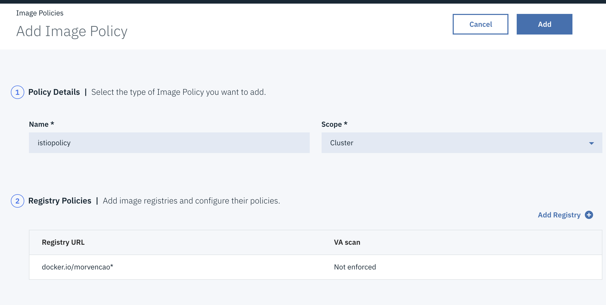

---


# Istio Lab

In recent years, with the development of container technology, more enterprise customers are turning to microservices. Microservices are a combination of lightweight and fine-grained services that work cohesively to allow for larger, application-wide functionality. This approach improves modularity and makes applications easier to develop and test when compared to traditional, monolithic application. With the adoption of microservices, new challenges emerge due to a myriad of services that exist in larger systems. Developers must now account for service discovery, load balancing, fault tolerance, dynamic routing, and communication security. Thanks to Istio, we can turn disparate microservices into an integrated service mesh by systemically injecting envoy proxy into the network layers while decoupling the operators to connect, manage, and secure microservices for application feature development.

This lab takes you step-by-step through the installation of Istio and the deployment of microservices-based applications in IBM Cloud Private.

> **Prerequisites** : you should be logged on your VM and connected to your ICP master. Istio should have been installed as part of the installation of ICP 3.1.x (istio: enabled)


### Table of Contents

---
- [Task1: Installing Istio on IBM Cloud Private](#task1--installing-istio-on-ibm-cloud-private)
- [Task2 - Deploy the Bookinfo application](#task2---deploy-the-bookinfo-application)
    + [Create Secret](#create-secret)
    + [Prepare the Bookinfo manifest](#prepare-the-bookinfo-manifest)
    + [Automatic Sidecar Injection](#automatic-sidecar-injection)
- [Task3: Access the Bookinfo application](#task3--access-the-bookinfo-application)
- [Task4: Collect Metrics with Prometheus](#task4--collect-metrics-with-prometheus)
- [Task5: Visualizing Metrics with Grafana](#task5--visualizing-metrics-with-grafana)
- [Congratulations](#congratulations)

---


# Introduction

This example deploys a sample application composed of four separate microservices used to demonstrate various Istio features. The application displays information about a book, similar to a single catalog entry of an online book store. Displayed on the page is a description of the book, book details (ISBN, number of pages, and so on), and a few book reviews.

The Bookinfo application is broken into four separate microservices:

- `productpage`. The `productpage` microservice calls the `details` and `reviews` microservices to populate the page.
- `details`. The `details` microservice contains book information.
- `reviews`. The `reviews` microservice contains book reviews. It also calls the `ratings` microservice.
- `ratings`. The `ratings` microservice contains book ranking information that accompanies a book review.

There are 3 versions of the `reviews` microservice:

- Version v1 doesn’t call the `ratings` service.
- Version v2 calls the `ratings` service, and displays each rating as 1 to 5 black stars.
- Version v3 calls the `ratings` service, and displays each rating as 1 to 5 red stars.

To run the sample with Istio requires no changes to the application itself. Instead, we simply need to configure and run the services in an Istio-enabled environment, with Envoy sidecars injected along side each service. The needed commands and configuration vary depending on the runtime environment although in all cases the resulting deployment will look like this:


# Task1: Check Istio on IBM Cloud Private 

Istio has been normal installed during your IBM Cloud Private installation (parameter "istio: enabled" in the config.yaml). You can also install istio after the IBM Cloud Private installation. 

Be sure to be at the latest version(this command upgrade ISTIO at the latest version):

```console
helm upgrade istio ibm-charts/ibm-istio --namespace istio-system --tls --set prometheus.enabled=true --set grafana.enabled=true
```

Ensure that the `istio-*` Kubernetes services are deployed before you continue.

```bash
kubectl get svc -n istio-system
```
Output:

```
# kubectl get svc -n istio-system
NAME                       TYPE           CLUSTER-IP     EXTERNAL-IP   PORT(S)                                                                                                                   AGE
grafana                    ClusterIP      10.0.26.247    <none>        3000/TCP                                                                                                                  10m
istio-citadel              ClusterIP      10.0.88.122    <none>        8060/TCP,9093/TCP                                                                                                         2d1h
istio-egressgateway        ClusterIP      10.0.200.201   <none>        80/TCP,443/TCP                                                                                                            2d1h
istio-galley               ClusterIP      10.0.162.143   <none>        443/TCP,9093/TCP                                                                                                          2d1h
istio-ingressgateway       LoadBalancer   10.0.3.165     <pending>     80:31380/TCP,443:31390/TCP,31400:31400/TCP,15011:32684/TCP,8060:32261/TCP,853:30607/TCP,15030:30645/TCP,15031:31132/TCP   2d1h
istio-pilot                ClusterIP      10.0.32.69     <none>        15010/TCP,15011/TCP,8080/TCP,9093/TCP                                                                                     2d1h
istio-policy               ClusterIP      10.0.7.193     <none>        9091/TCP,15004/TCP,9093/TCP                                                                                               2d1h
istio-sidecar-injector     ClusterIP      10.0.165.232   <none>        443/TCP                                                                                                                   2d1h
istio-statsd-prom-bridge   ClusterIP      10.0.83.226    <none>        9102/TCP,9125/UDP                                                                                                         2d1h
istio-telemetry            ClusterIP      10.0.119.86    <none>        9091/TCP,15004/TCP,9093/TCP,42422/TCP                                                                                     2d1h
prometheus                 ClusterIP      10.0.75.229    <none>        9090/TCP                                                                                                                  10m
```
  **Note: the istio-ingressgateway service will be in `pending` state with no external ip. That is normal.**

Ensure the corresponding pods `istio-citadel-*`, `istio-ingressgateway-*`, `istio-pilot-*`, and `istio-policy-*` are all in **`Running`** state before you continue.

```
kubectl get pods -n istio-system
```
Output:

```
# kubectl get pods -n istio-system
NAME                                        READY   STATUS    RESTARTS   AGE
grafana-cbc8c66bb-675m8                     1/1     Running   0          11m
istio-citadel-7cc85b9986-dxh77              1/1     Running   0          11m
istio-egressgateway-79895bb8f7-ffbnv        1/1     Running   0          10m
istio-egressgateway-79895bb8f7-fjcpx        1/1     Running   0          11m
istio-egressgateway-79895bb8f7-gbmsf        1/1     Running   0          10m
istio-egressgateway-79895bb8f7-jszdf        1/1     Running   0          9m42s
istio-egressgateway-79895bb8f7-rgmc4        1/1     Running   0          11m
istio-galley-77554979fc-nzn2p               1/1     Running   0          11m
istio-ingressgateway-56758bf968-hdmvx       1/1     Running   0          9m44s
istio-ingressgateway-56758bf968-j9896       1/1     Running   0          10m
istio-ingressgateway-56758bf968-l6nbq       1/1     Running   0          11m
istio-ingressgateway-56758bf968-np7bn       1/1     Running   0          11m
istio-ingressgateway-56758bf968-qlfw9       1/1     Running   0          10m
istio-pilot-599f699d55-d76xp                2/2     Running   0          11m
istio-policy-f8fcb8496-467jg                2/2     Running   0          11m
istio-policy-f8fcb8496-8q9w6                2/2     Running   0          10m
istio-policy-f8fcb8496-bnqwn                2/2     Running   0          11m
istio-policy-f8fcb8496-dml6g                2/2     Running   0          9m20s
istio-policy-f8fcb8496-vjh7f                2/2     Running   0          10m
istio-sidecar-injector-864d889459-7z2g9     1/1     Running   0          11m
istio-statsd-prom-bridge-75cc7c6c45-pk2r7   1/1     Running   0          11m
istio-telemetry-665689b445-85nqv            2/2     Running   0          10m
istio-telemetry-665689b445-dr525            2/2     Running   0          11m
istio-telemetry-665689b445-flksx            2/2     Running   0          9m15s
istio-telemetry-665689b445-kx4dz            2/2     Running   0          11m
istio-telemetry-665689b445-swqzv            2/2     Running   0          9m44s
prometheus-77c5cc6dbd-b8598                 1/1     Running   0          11m

```

Before your continue, make sure all the pods are deployed and **`Running`**. If they're in `pending` state, wait a few minutes to let the deployment finish.

Congratulations! You successfully installed Istio into your cluster.


# Task2 - Deploy the Bookinfo application
If the **control plane** is deployed successfully, you can then start to deploy your applications that are managed by Istio. I will use the **Bookinfo** application as an example to illustrate the steps of deploying applications that are managed by Istio.

### Create Secret

If you are using a private registry for the sidecar image, then you need to create a Secret of type docker-registry in the cluster that holds authorization token, and patch it to your application’s ServiceAccount. Use the following 2 commands (replace mycluster.icp with yours):

```bash 
kubectl create secret docker-registry private-registry-key \
  --docker-server=<mycluster.icp>:8500 \
  --docker-username=admin \
  --docker-password=admin1! \
  --docker-email=null
```

For instance:

```console
kubectl -n default create secret docker-registry private-registry-key --docker-server=nicemmm.icp:8500 --docker-username=admin --docker-password=admin1! --docker-email=null
```

Then patch the service account:

```bash
kubectl patch serviceaccount default -p '{"imagePullSecrets": [{"name": "private-registry-key"}]}'
```


### Prepare the Bookinfo manifest

Return to your directory:

`cd`

Create a new YAML file named **bookinfo.yaml** to save the Bookinfo application manifest.

This file is located in 

**Don't create the kurbenetes resources yet**.


### Automatic Sidecar Injection

If you have enabled automatic sidecar injection, the istio-sidecar-injector automatically injects Envoy **proxy** containers into your **application pods** that are running in the namespaces, labelled with istio-injection=enabled. For example, let's deploy the Bookinfo application to the default namesapce.

`kubectl label namespace default istio-injection=enabled`

Add an image policy before.

To add a <u>Cluster Image Policy</u>, go to the **Menu > Manage > Resource Security**


Now let's add a new policy for our LDAP image and click on the **Create Image Policy**:


Fill the name field with **istiopolicy** 

Then click **add a registry policy** and type : `docker.io/istio*` and `docker.io/istio/*`



Finish by clicking **Add** at the top right.

Now, here is the command to inject the sidecar when deploying the application:

`kubectl create -n default -f bookinfo.yaml`

Results:

```console
kubectl create -n default -f bookinfo.yaml
service "details" created
deployment.extensions "details-v1" created
service "ratings" created
deployment.extensions "ratings-v1" created
service "reviews" created
deployment.extensions "reviews-v1" created
deployment.extensions "reviews-v2" created
deployment.extensions "reviews-v3" created
service "productpage" created
deployment.extensions "productpage-v1" created
ingress.extensions "gateway" created
```

To check that the injection was successful, go to ICP console, click on the **Menu>Workload>Deployments**


Go to **productpage** deployment, then **drill down to POD** and then **drill down to containers.** You should have 2 containers in one POD. The istio-proxy is the side-car container running aside the application container. 


Now that the Bookinfo services are up and running, you need to make the application accessible from outside of your Kubernetes cluster, e.g., from a browser. An [Istio Gateway](https://istio.io/docs/concepts/traffic-management/#gateways) is used for this purpose.


**Cut and paste** the following command :

```console
kubectl create -f - <<EOF
apiVersion: networking.istio.io/v1alpha3
kind: Gateway
metadata:
  name: bookinfo-gateway
spec:
  selector:
    istio: ingressgateway # use istio default controller
  servers:
  - port:
      number: 80
      name: http
      protocol: HTTP
    hosts:
    - "*"
---
apiVersion: networking.istio.io/v1alpha3
kind: VirtualService
metadata:
  name: bookinfo
spec:
  hosts:
  - "*"
  gateways:
  - bookinfo-gateway
  http:
  - match:
    - uri:
        exact: /productpage
    - uri:
        exact: /login
    - uri:
        exact: /logout
    - uri:
        prefix: /api/v1/products
    route:
    - destination:
        host: productpage
        port:
          number: 9080
---
EOF
```

Check the gateway is running:

`kubectl get gateway`

Results:

```console
# kubectl get gateway
NAME               AGE
bookinfo-gateway   22s
```


# Task3: Access the Bookinfo application

After all pods for the Bookinfo application are in a running state and the gateway has been created,  you can access the Bookinfo **product page**. 

Display the service:

`kubectl get svc istio-ingressgateway -n istio-system`

Results:

```console
 # kubectl get svc istio-ingressgateway -n istio-system
NAME                   TYPE           CLUSTER-IP   EXTERNAL-IP   PORT(S)                                                                                                                   AGE
istio-ingressgateway   LoadBalancer   10.0.3.165   <pending>     80:31380/TCP,443:31390/TCP,31400:31400/TCP,15011:32684/TCP,8060:32261/TCP,853:30607/TCP,15030:30645/TCP,15031:31132/TCP   24h
```
If the `EXTERNAL-IP` value is set, your environment has an external load balancer that you can use for the ingress gateway. If the `EXTERNAL-IP` value is `<none>` (or perpetually `<pending>`), your environment does not provide an external load balancer for the ingress gateway. In this case, you can access the gateway using the service’s [node port](https://kubernetes.io/docs/concepts/services-networking/service/#nodeport).

We are going to use the **node port** to get access from the outside of the cluster (we don't have a loadbalancer).

Use these 2 commands to set variables :

```console
export INGRESS_PORT=$(kubectl -n istio-system get service istio-ingressgateway -o jsonpath='{.spec.ports[?(@.name=="http2")].nodePort}')
export SECURE_INGRESS_PORT=$(kubectl -n istio-system get service istio-ingressgateway -o jsonpath='{.spec.ports[?(@.name=="https")].nodePort}')

```

As a result, it shows the 2 variables:

```console
# echo $INGRESS_PORT
31380
# echo $SECURE_INGRESS_PORT
31390
```

Now that we have the ports, let us find the IP:

```console
export INGRESS_HOST=$(kubectl get po -l istio=ingressgateway -n istio-system -o 'jsonpath={.items[0].status.hostIP}')
export GATEWAY_URL=$INGRESS_HOST:$INGRESS_PORT
```

As a result, show the variable:

```console
# echo $GATEWAY_URL
158.176.83.201:31380
```

Now check the following URL:

`curl -s http://${GATEWAY_URL}/productpage | grep -o "<title>.*</title>"`

Results:

```console
# curl -s http://${GATEWAY_URL}/productpage | grep -o "<title>.*</title>"
<title>Simple Bookstore App</title>
```

Now that we can get the title, let us try this on a browser:

`http://${GATEWAY_URL}/productpage`

Results:


Try to refresh the page several times, you will see different versions of reviews **randomly** shown in the product page(red stars, black stars, no stars), because I haven’t created any route rule for the Bookinfo application.


# Task4: Collect Metrics with Prometheus

In this section, you can see how to configure Istio to automatically gather telemetry and create new customized telemetry for services. I will use the Bookinfo application as an example.

Istio can enable Prometheus with a service type of ClusterIP. You can also expose another service of type NodePort and then access Prometheus by running the following command:

```console
kubectl expose service prometheus --type=NodePort  --name=istio-prometheus-svc --namespace istio-system
```


```console
export PROMETHEUS_URL=$(kubectl get po -l app=prometheus \
      -n istio-system -o 'jsonpath={.items[0].status.hostIP}'):$(kubectl get svc \
      istio-prometheus-svc -n istio-system -o 'jsonpath={.spec.ports[0].nodePort}')
```

Check the results:

`echo http://${PROMETHEUS_URL}/ `       

Results:
```console
# echo http://${PROMETHEUS_URL}/
http://5.10.96.73:31316/
```


Use the ${PROMETHEUS_URL} to get access to prometheus from a browser.

Then type `istio_response_bytes_sum` in the first field and click execute button:


Move to the right to see the metrics collected:


If you don't see anything, retry the following command several times:
`curl -o /dev/null -s -w "%{http_code}\n" http://<masterip>:9080/productpage` 

# Task5: Visualizing Metrics with Grafana

Now I will setup and use the Istio Dashboard to monitor the service mesh traffic. I will use the Bookinfo application as an example.

Similar to Prometheus, Istio enables Grafana with a service type of ClusterIP. You need to expose another service of type NodePort to access Grafana from the external environment by running the following commands:

```console
kubectl expose service grafana --type=NodePort --name=istio-grafana-svc --namespace istio-system
```

Then export a variable:

```
export GRAFANA_URL=$(kubectl get po -l app=grafana -n \
      istio-system -o 'jsonpath={.items[0].status.hostIP}'):$(kubectl get svc \
      istio-grafana-svc -n istio-system -o \
      'jsonpath={.spec.ports[0].nodePort}')
```

Finally:

`echo http://${GRAFANA_URL}/`

Results:
```console
echo http://${GRAFANA_URL}
http://5.10.96.73:30915
```
Access the Grafana web page from your browser http://${GRAFANA_URL}/.

By default, Istio grafana has some built-in dashboards: Istio Dashboard, Mixer Dashboard and Pilot Dashboard. Istio Mesh Dashboard is an overall view for all service traffic including high-level HTTP requests flowing and metrics about each individual service call, while Mixer Dashboard and Pilot Dashboard are mainly resources usage overview.

Click on the top left HOME button and you should see all the built-in dashboards:


The Istio Mesh Dashboard resembles the following screenshot:


​      


# Congratulations 

You have successfully installed, deployed and customized the **Istio** for an **IBM Cloud Private** cluster.

In this lab, I have gone through how to enable Istio on IBM Cloud Private 3.1.2.  I also reviewed how to deploy microservice-based application that are managed and secured by Istio. The lab also covered how to manage, and monitor microservices with Istio addons such as Prometheus and Grafana.

Istio solves the microservices mesh tangle challenge by injecting a transparent envoy proxy as a sidecar container to application pods. Istio can collect fine-grained metrics and dynamically modify the routing flow without interfering with the original application. This provides a uniform way to connect, secure, manage, and monitor microservices.

For more information about Istio, see https://istio.io/docs/.

----


